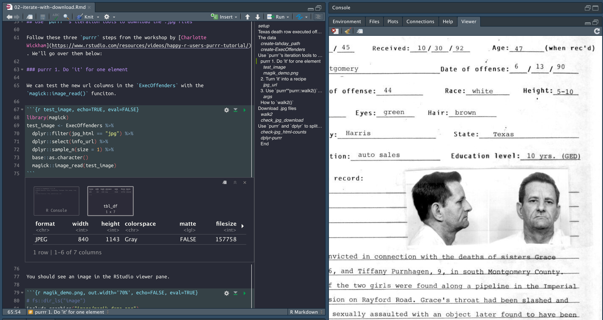

```{r setup, include=FALSE}
library(knitr)
library(rmdformats)
library(hrbrthemes)
library(tidyverse)
library(rvest)
library(XML)
library(magrittr)
library(xml2)
library(here)
# figs folder
if (!file.exists("figs")) {
  dir.create("figs")
}
# chunk options
knitr::opts_chunk$set(
  echo = TRUE, # show/hide all code
  # results = "hide", # hide results
  tidy = FALSE, # cleaner code printing
  comment = "#> ", # better console printing
  eval = TRUE, # turn this to FALSE stop code chunks from running
  message = TRUE, # show messages
  warning = FALSE, # show warnings
  size = "small", # size of the text
  fig.path = "figs/", # location of files
  fig.height = 7.5, # height of figures
  fig.width = 10 # width of figures
) # width of figures
# knit options
opts_knit$set(width = 75)
```


# Texas death row executed offenders website

In the previous .Rmd, we downloaded the data table from the [Texas Department of Criminal Justice website](http://www.tdcj.state.tx.us/death_row/dr_executed_offenders.html), which keeps records of every inmate they execute. 

## The data 

These data are imported from the .Rmd we used to scrape the website. These data are in the folder below. 

```{r DirProcessed}
DirProcessed <- fs::dir_tree("data/processed") %>% 
  tibble::enframe(name = NULL) %>% 
  dplyr::arrange(desc(value))
```

This will import the most recent data.

```{r create-ExecOffenders}
ExecOffenders <- readr::read_csv(DirProcessed[[1]][1])
```

In this post, we wil use `purrr`s iteration tools to download the images attached to the website profiles.

## Use `purrr`'s iteration tools to download the .jpg files

Follow these three `purrr` steps from the workshop by [Charlotte Wickham](https://www.rstudio.com/resources/videos/happy-r-users-purrr-tutorial/). We'll go over them below:

### purrr 1. Do 'it' for one element

We can test the new url columns in the `ExecOffenders` with the `magick::image_read()` funciton. 

```{r test_image, echo=TRUE, eval=FALSE}
library(magick)
test_image <- ExecOffenders %>% 
  dplyr::filter(jpg_html == "jpg") %>% 
  dplyr::select(info_url) %>% 
  dplyr::sample_n(size = 1) %>% 
  base::as.character() 
  magick::image_read(test_image)
```

You should see an image in the RStudio viewer pane (like below)

```{r magik_demo.png, out.width='70%', echo=FALSE, eval=TRUE}
# fs::dir_ls("figs")

```

### 2. Turn 'it' into a recipe

`dplyr::filter` the `ExecOffenders` into `ExOffndrsCompleteJpgs`. Put these urls into a vector (`jpg_url`), then create a folder to download them into (`jpg_path`).

```{r jpg_url}
ExOffndrsCompleteJpgs <- ExecOffenders %>% 
  dplyr::filter(jpg_html == "jpg") 
jpg_url <- ExOffndrsCompleteJpgs$info_url
if (!base::file.exists("jpgs/")) {
  base::dir.create("jpgs/")
}
jpg_path <- paste0("jpgs/", 
                   # create basename
              base::basename(jpg_url))
jpg_path %>% utils::head()
```

### 3. Use `purrr""purrr::walk2()` to download all files

Now use the `purrr::walk2()` function to download the files. How does `walk2` work?

First look at the arguments for `utils::download.file()`.

```{r args, eval=FALSE}
?utils::download.file
```

### How to `walk2()` 
 
The help files tell us the `walk2` function is "specialized for the two argument case". So `.x` and `.y` become the two arguments we need to iterate over `download.file()`. We will walk through this step-by-step below:

1) `.x` = the file path, which we created with the selector gadget above (in `jpg_url`)

2) `.y` = the location we want the files to end up (`jpg_path`), and

3) the function we want to iterate over `.x` and `.y` (`download.file`).

When we pass everything to `purrr::walk2`, R will go to the URL, download the file located at the URL, and put it in the associated `jpgs/` folder.

## Download .jpg files

Execute the code below and you will see the .jpgs downloading into the `jpg` folder.

```{r walk2, eval=FALSE}
purrr::walk2(.x = jpg_url, 
             .y = jpg_path, 
             .f = download.file)
```

You should see the following in your console.

```{r image-walk2.gif, out.width='70%', echo=FALSE}
# fs::dir_ls("figs")
knitr::include_graphics(path = "figs/2019-11-27-image-walk2.gif")
```

You  will see text similar to the content below.

```r
# trying URL 'http://www.tdcj.state.tx.us/death_row/dr_info/robisonlarry.jpg'
# Content type 'image/jpeg' length 108341 bytes (105 KB)
# ==================================================
# downloaded 105 KB
# 
# trying URL 'http://www.tdcj.state.tx.us/death_row/dr_info/hicksdavid.jpg'
# Content type 'image/jpeg' length 139150 bytes (135 KB)
# ==================================================
# downloaded 135 KB
```

This might take awhile, but when its done, check the number of files in this folder.

```{r check_jpg_download, eval=TRUE, echo=TRUE}
fs::dir_info("jpgs") %>% 
  tibble::as_tibble() %>% 
  dplyr::arrange(desc(size)) %>% 
  dplyr::select(path, type, size) %>% 
  utils::head(10)
```

There you have it! 380 images of downloaded offenders! Export the data for the next step.

```{r tahday}
# create data folder
if (!fs::dir_exists("data")) {
  fs::dir_create("data")
}
# create processed folder 
if (!fs::dir_exists("data/processed")) {
  fs::dir_create("data/processed")
}
# create today
tahday <- as.character(lubridate::today())
tahday_path <- file.path("data/processed", tahday)
# tahday_path
# create new data folder
if (!fs::dir_exists(tahday_path)) {
  fs::dir_create(tahday_path)
}
# export these data
readr::write_csv(as.data.frame(ExecOffenders),
                 path = paste0(tahday_path, "/", 
                               tahday,"-ExecOffenders.csv"))
fs::dir_tree("data")
```