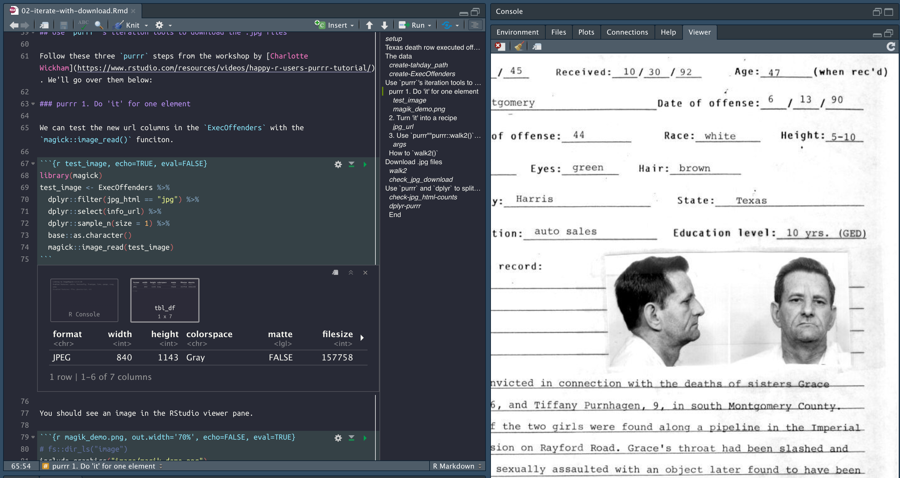

Don’t Mess with Texas Part 2: downloading files with `purrr`
================
Martin Frigaard
2019-11-28

# Texas death row executed offenders website

In the previous .Rmd, we downloaded the data table from the [Texas
Department of Criminal Justice
website](http://www.tdcj.state.tx.us/death_row/dr_executed_offenders.html),
which keeps records of every inmate they execute.

## The data

These data are imported from the .Rmd we used to scrape the website.
These data are in the folder below.

``` r
DirProcessed <- fs::dir_tree("data/processed") %>% 
  as_tibble() %>% 
  dplyr::arrange(desc(value))
```

    #>  data/processed
    #>  ├── 2018-12-20
    #>  │   ├── 2018-12-20-ExExOffndrshtml.csv
    #>  │   ├── 2018-12-20-ExExOffndrsjpg.csv
    #>  │   └── 2018-12-20-ExOffndrsComplete.csv
    #>  ├── 2019-11-27
    #>  │   └── 2019-11-27-ExOffndrsComplete.csv
    #>  └── 2019-11-28
    #>      └── 2019-11-28-ExecOffenders.csv

``` r
ExecOffenders <- readr::read_csv(DirProcessed[[1]][1])
```

    #>  Parsed with column specification:
    #>  cols(
    #>    last_name = col_character(),
    #>    first_name = col_character(),
    #>    last_url = col_character(),
    #>    info_url = col_character(),
    #>    execution = col_double(),
    #>    offender_info = col_character(),
    #>    last_statement = col_character(),
    #>    tdcj_number = col_double(),
    #>    age = col_double(),
    #>    date = col_character(),
    #>    race = col_character(),
    #>    county = col_character(),
    #>    last_url1 = col_character(),
    #>    info_url1 = col_character(),
    #>    jpg_html = col_character()
    #>  )

In this post, we wil use `purrr`s iteration tools to download the images
attached to the website profiles.

## Use `purrr`’s iteration tools to download the .jpg files

Follow these three `purrr` steps from the workshop by [Charlotte
Wickham](https://www.rstudio.com/resources/videos/happy-r-users-purrr-tutorial/).
We’ll go over them below:

### purrr 1. Do ‘it’ for one element

We can test the new url columns in the `ExecOffenders` with the
`magick::image_read()` funciton.

``` r
library(magick)
test_image <- ExecOffenders %>% 
  dplyr::filter(jpg_html == "jpg") %>% 
  dplyr::select(info_url) %>% 
  dplyr::sample_n(size = 1) %>% 
  base::as.character() 
  magick::image_read(test_image)
```

You should see an image in the RStudio viewer pane (like below)



### 2\. Turn ‘it’ into a recipe

`dplyr::filter` the `ExecOffenders` into `ExOffndrsCompleteJpgs`. Put
these urls into a vector (`jpg_url`), then create a folder to download
them into (`jpg_path`).

``` r
ExOffndrsCompleteJpgs <- ExecOffenders %>% 
  dplyr::filter(jpg_html == "jpg") 
jpg_url <- ExOffndrsCompleteJpgs$info_url
if (!base::file.exists("jpgs/")) {
  base::dir.create("jpgs/")
}
jpg_path <- paste0("jpgs/", 
                   # create basename
              base::basename(jpg_url))
jpg_path %>% utils::head()
```

    #>  [1] "jpgs/_coble.jpg"         "jpgs/jenningsrobert.jpg"
    #>  [3] "jpgs/_ramos.jpg"         "jpgs/bigbyjames.jpg"    
    #>  [5] "jpgs/ruizroland.jpg"     "jpgs/garciagustavo.jpg"

### 3\. Use `purrr""purrr::walk2()` to download all files

Now use the `purrr::walk2()` function to download the files. How does
`walk2` work?

First look at the arguments for `utils::download.file()`.

``` r
?utils::download.file
```

### How to `walk2()`

The help files tell us the `walk2` function is “specialized for the two
argument case”. So `.x` and `.y` become the two arguments we need to
iterate over `download.file()`. We will walk through this step-by-step
below:

1)  `.x` = the file path, which we created with the selector gadget
    above (in `jpg_url`)

2)  `.y` = the location we want the files to end up (`jpg_path`), and

3)  the function we want to iterate over `.x` and `.y`
    (`download.file`).

When we pass everything to `purrr::walk2`, R will go to the URL,
download the file located at the URL, and put it in the associated
`jpgs/` folder.

## Download .jpg files

Execute the code below and you will see the .jpgs downloading into the
`jpg` folder.

``` r
purrr::walk2(.x = jpg_url, 
             .y = jpg_path, 
             .f = download.file)
```

You should see the following in your console.


You will see text similar to the content below.

``` r
# trying URL 'http://www.tdcj.state.tx.us/death_row/dr_info/robisonlarry.jpg'
# Content type 'image/jpeg' length 108341 bytes (105 KB)
# ==================================================
# downloaded 105 KB
# 
# trying URL 'http://www.tdcj.state.tx.us/death_row/dr_info/hicksdavid.jpg'
# Content type 'image/jpeg' length 139150 bytes (135 KB)
# ==================================================
# downloaded 135 KB
```

This might take awhile, but when its done, check the number of files in
this folder.

``` r
fs::dir_info("jpgs") %>% 
  tibble::as_tibble() %>% 
  dplyr::arrange(desc(size)) %>% 
  dplyr::select(path, type, size) %>% 
  utils::head(10)
```

    #>  # A tibble: 10 x 3
    #>     path                      type         size
    #>     <fs::path>                <fct> <fs::bytes>
    #>   1 jpgs/riddlegranville.jpg  file         244K
    #>   2 jpgs/kellyalvin.jpg       file         225K
    #>   3 jpgs/jacobsjesse.jpg      file         202K
    #>   4 jpgs/demouchettejames.jpg file         195K
    #>   5 jpgs/duffsmithmarkum.jpg  file         190K
    #>   6 jpgs/hernadezadolph.jpg   file         189K
    #>   7 jpgs/tuckerjefferey.jpg   file         189K
    #>   8 jpgs/briddlejames.jpg     file         189K
    #>   9 jpgs/teaguedelbert.jpg    file         187K
    #>  10 jpgs/hoguejerry.jpg       file         186K

There you have it\! 380 images of downloaded offenders\! Export the data
for the next step.

``` r
# create data folder
if (!fs::dir_exists("data")) {
  fs::dir_create("data")
}
# create processed folder 
if (!fs::dir_exists("data/processed")) {
  fs::dir_create("data/processed")
}
# create today
tahday <- as.character(lubridate::today())
tahday_path <- file.path("data/processed", tahday)
# tahday_path
# create new data folder
if (!fs::dir_exists(tahday_path)) {
  fs::dir_create(tahday_path)
}
# export these data
readr::write_csv(as.data.frame(ExecOffenders),
                 path = paste0(tahday_path, "/", 
                               tahday,"-ExecOffenders.csv"))
fs::dir_tree("data")
```

    #>  data
    #>  └── processed
    #>      ├── 2018-12-20
    #>      │   ├── 2018-12-20-ExExOffndrshtml.csv
    #>      │   ├── 2018-12-20-ExExOffndrsjpg.csv
    #>      │   └── 2018-12-20-ExOffndrsComplete.csv
    #>      ├── 2019-11-27
    #>      │   └── 2019-11-27-ExOffndrsComplete.csv
    #>      └── 2019-11-28
    #>          └── 2019-11-28-ExecOffenders.csv
