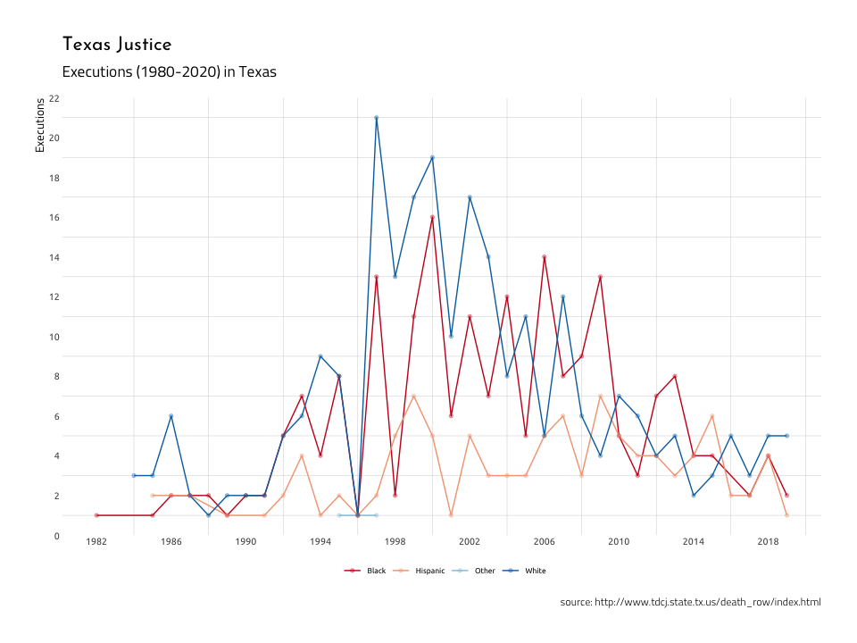

Manipulating images with `magick`
================
Martin Frigaard
2019-11-28

# Texas death row executed offenders website

This continues with the [Texas Department of Criminal Justice
data](http://www.tdcj.state.tx.us/death_row/dr_executed_offenders.html),
which keeps records of every inmate executed.

We will load previous .csv file of all executions.

## Packages

``` r
library(knitr)
library(rmdformats)
library(hrbrthemes)
library(tidyverse)
library(rvest)
library(XML)
library(magrittr)
library(xml2)
library(here)
library(magick)
```

## Import the data

``` r
DirProcessed <- fs::dir_tree("data/processed") %>%
  tibble::enframe(name = NULL) %>%
  dplyr::arrange(desc(value))
```

    #>  data/processed
    #>  ├── 2018-12-20
    #>  │   ├── 2018-12-20-ExExOffndrshtml.csv
    #>  │   ├── 2018-12-20-ExExOffndrsjpg.csv
    #>  │   └── 2018-12-20-ExOffndrsComplete.csv
    #>  ├── 2019-11-27
    #>  │   └── 2019-11-27-ExOffndrsComplete.csv
    #>  └── 2019-11-28
    #>      ├── 2019-11-28-ExExOffndrshtml.csv
    #>      ├── 2019-11-28-ExExOffndrsjpg.csv
    #>      ├── 2019-11-28-ExOffndrsComplete.csv
    #>      └── 2019-11-28-ExecOffenders.csv

This will import the most recent data.

``` r
ExecOffenders <- readr::read_csv(DirProcessed[[1]][1])
```

    #>  Parsed with column specification:
    #>  cols(
    #>    last_name = col_character(),
    #>    first_name = col_character(),
    #>    execution = col_double(),
    #>    offender_info = col_character(),
    #>    last_statement = col_character(),
    #>    tdcj_number = col_double(),
    #>    age = col_double(),
    #>    date = col_character(),
    #>    race = col_character(),
    #>    county = col_character(),
    #>    last_url = col_character(),
    #>    info_url = col_character(),
    #>    name_last_url = col_character(),
    #>    dr_info_url = col_character(),
    #>    jpg_html = col_character()
    #>  )

Wrangle these date variables,

``` r
ExecOffenders <- ExecOffenders %>%
  dplyr::mutate(
    date = lubridate::mdy(date),
    year = lubridate::year(date),
    yday = lubridate::yday(date),
    month = lubridate::month(date, label = TRUE)) 
```

``` r
ExecOffenders %>% skimr::skim()
```

|                                                  |            |
| :----------------------------------------------- | :--------- |
| Name                                             | Piped data |
| Number of rows                                   | 566        |
| Number of columns                                | 18         |
| \_\_\_\_\_\_\_\_\_\_\_\_\_\_\_\_\_\_\_\_\_\_\_   |            |
| Column type frequency:                           |            |
| character                                        | 11         |
| Date                                             | 1          |
| factor                                           | 1          |
| numeric                                          | 5          |
| \_\_\_\_\_\_\_\_\_\_\_\_\_\_\_\_\_\_\_\_\_\_\_\_ |            |
| Group variables                                  | None       |

Data summary

**Variable type: character**

| skim\_variable  | n\_missing | complete\_rate | min | max | empty | n\_unique | whitespace |
| :-------------- | ---------: | -------------: | --: | --: | ----: | --------: | ---------: |
| last\_name      |          0 |              1 |   3 |  15 |     0 |       458 |          0 |
| first\_name     |          0 |              1 |   3 |  11 |     0 |       267 |          0 |
| offender\_info  |          0 |              1 |  20 |  20 |     0 |         1 |          0 |
| last\_statement |          0 |              1 |  14 |  14 |     0 |         1 |          0 |
| race            |          0 |              1 |   5 |   8 |     0 |         4 |          0 |
| county          |          0 |              1 |   3 |  12 |     0 |        93 |          0 |
| last\_url       |          0 |              1 |  61 |  78 |     0 |       465 |          0 |
| info\_url       |          0 |              1 |  56 |  74 |     0 |       556 |          0 |
| name\_last\_url |          0 |              1 |  61 |  78 |     0 |       465 |          0 |
| dr\_info\_url   |          0 |              1 |  56 |  74 |     0 |       556 |          0 |
| jpg\_html       |          0 |              1 |   3 |   4 |     0 |         2 |          0 |

**Variable type: Date**

| skim\_variable | n\_missing | complete\_rate | min        | max        | median     | n\_unique |
| :------------- | ---------: | -------------: | :--------- | :--------- | :--------- | --------: |
| date           |          0 |              1 | 1982-12-07 | 2019-11-06 | 2002-09-24 |       563 |

**Variable type: factor**

| skim\_variable | n\_missing | complete\_rate | ordered | n\_unique | top\_counts                        |
| :------------- | ---------: | -------------: | :------ | --------: | :--------------------------------- |
| month          |          0 |              1 | TRUE    |        12 | Jan: 60, May: 58, Jun: 57, Aug: 51 |

**Variable type: numeric**

| skim\_variable | n\_missing | complete\_rate |      mean |        sd |   p0 |     p25 |      p50 |       p75 |   p100 | hist  |
| :------------- | ---------: | -------------: | --------: | --------: | ---: | ------: | -------: | --------: | -----: | :---- |
| execution      |          0 |              1 |    283.50 |    163.53 |    1 |  142.25 |    283.5 |    424.75 |    566 | ▇▇▇▇▇ |
| tdcj\_number   |          0 |              1 | 531777.63 | 498661.41 |  511 |  819.25 | 999033.0 | 999269.75 | 999571 | ▇▁▁▁▇ |
| age            |          0 |              1 |     39.73 |      8.83 |   24 |   33.00 |     38.0 |     45.00 |     70 | ▆▇▅▂▁ |
| year           |          0 |              1 |   2002.74 |      8.02 | 1982 | 1997.00 |   2002.0 |   2009.00 |   2019 | ▁▂▇▅▃ |
| yday           |          0 |              1 |    173.96 |    102.55 |    4 |   85.00 |    167.5 |    263.00 |    352 | ▇▇▆▇▇ |

These data are already pretty clean, but we will be using the .jpgs I’ve
downloaded in the `02-iterate-with-download.Rmd` file.

## The `magik` package

I will be using the
[magik](https://cran.r-project.org/web/packages/magick/vignettes/intro.html)
package for processing and manipulating these images. I advise checking
out the entire vignette for more examples.

## Create a test image

I wanted to pick an offender that was typical, meaning they represented
the ‘average’ person from this sample. As I can see from the `skimr`
output above, mean `age` is `40.1` (median is `39`), so I will start
there. We will build a sample of age that is the mean +/- the standard
deviation.

``` r
ExecOffenders %>% 
  # age 40
  dplyr::filter(age <= 48.97 & 
                  age >= 31.23)
```

    #>  # A tibble: 371 x 18
    #>     last_name first_name execution offender_info last_statement tdcj_number   age
    #>     <chr>     <chr>          <dbl> <chr>         <chr>                <dbl> <dbl>
    #>   1 Hall      Justen           566 Offender Inf… Last Statement      999497    38
    #>   2 Sparks    Robert           565 Offender Inf… Last Statement      999542    45
    #>   3 Soliz     Mark             564 Offender Inf… Last Statement      999571    37
    #>   4 Swearing… Larry            562 Offender Inf… Last Statement      999361    48
    #>   5 King      John             561 Offender Inf… Last Statement      999295    44
    #>   6 Braziel,… Alvin            558 Offender Inf… Last Statement      999393    43
    #>   7 Garcia    Joseph           557 Offender Inf… Last Statement      999441    47
    #>   8 Acker     Daniel           555 Offender Inf… Last Statement      999381    46
    #>   9 Young     Christoph…       553 Offender Inf… Last Statement      999508    34
    #>  10 Castillo  Juan             551 Offender Inf… Last Statement      999502    37
    #>  # … with 361 more rows, and 11 more variables: date <date>, race <chr>,
    #>  #   county <chr>, last_url <chr>, info_url <chr>, name_last_url <chr>,
    #>  #   dr_info_url <chr>, jpg_html <chr>, year <dbl>, yday <dbl>, month <ord>

We can also check the `race` based on these 252 offenders that have an
age of 40.

``` r
ExecOffenders %>% 
  # age 40 +/- 
  dplyr::filter(age <= 48.97 & 
                  age >= 31.23) %>% 
  
  dplyr::count(race)
```

    #>  # A tibble: 4 x 2
    #>    race         n
    #>    <chr>    <int>
    #>  1 Black      136
    #>  2 Hispanic    75
    #>  3 Other        2
    #>  4 White      158

The majority of these offenders are `White`, so I can weight this sample
with the `race` variable (but I have to make it numeric). I also need to
filter the links to the .jpgs, and return the `info_url` as a character.

``` r
ExecOffendersSample <- ExecOffenders %>% 
  # age 40
  dplyr::filter(age == 40) %>% 
  dplyr::mutate(race_num = 
                  case_when(race == "Black" ~ 1,
                            race == "Hispanic" ~ 2, 
                            race == "Other" ~ 3, 
                            race == "White" ~ 4)) 
ExecOffendersSample %>% 
  # weight the sample with race
  dplyr::sample_n(size = 1, weight = race_num) %>% 
  # only jpgs
  dplyr::filter(jpg_html == "jpg") %>% 
  # get the info url
  dplyr::select(info_url) %>% 
  # get the character 
  as.character() -> test_image
test_image
```

    #>  [1] "character(0)"

Convert this to a `magick` image using the `image_read()` function. The
code below selects a jpg at random, and If I print this within the
Rmarkdown file, I see the output in the viewer pane.

## Read, write, join, or combine

I create `test_magick_img` from `magick::image_read()`, and then go on
making the transformations as necessary.

``` r
test_magick_img <- magick::image_read(test_image)
test_magick_img
```

<!-- -->

This images comes up in the viewer pane.

*TIP: come up with a naming convention for each step so you can use
RStudio’s viewer pane to see the manipulations.*

The executed offender is [Stevn Coen
Renfro](https://murderpedia.org/male.R/r1/renfro-steven.htm) from
Harrison Texas. He was executed on Februrary 9th, 1998.

## Basic transformations

These functions are for basic image movement/manipulations you would do
with any basic photo editing app.

### Crop with `magick::image_crop()`

Now I want to remove the text and focus on the mugshot. This might need
to be adjusted slightly for each new `test_magick_img`.

``` r
# crop this image
test_magick_crop1 <- magick::image_crop(
  image = test_magick_img,
  geometry = "750x1000+10"
)
test_magick_crop1
```

<!-- -->

This should have trimmed the extra space off the bottom of the image.

### Rotate with `magick::image_rotate()`

I want to rotate this image by 90 degrees.

``` r
# rotate this image
test_magick_rotate90 <- magick::image_rotate(test_magick_crop1,
  degrees = 90
)
test_magick_rotate90
```

<!-- -->

This is what it looks like in RStudio.

<!-- -->

Now I want to remove the rest of the text and focus on the mugshot. This
might need to be adjusted slightly for each new `test_image`.

``` r
# crop this image
test_magick_crop2 <- magick::image_crop(
  image = test_magick_rotate90,
  geometry = "850x950+450"
)
test_magick_crop2
```

<!-- -->

Now I will rotate this image back to center (`image_rotate` again) and
flip it using `magick::image_flip()`

``` r
# rotate this image
test_magick_rotate270 <- magick::image_rotate(test_magick_crop2,
  degrees = 270)
# rotate this image
test_magick_flip <- magick::image_flip(test_magick_rotate270)
test_magick_flip
```

<!-- -->

I’ll crop the rest of the text out of the image, and trim the whitespace
for the plot.

``` r
# crop this image
test_magick_crop3 <- magick::image_crop(
  image = test_magick_flip,
  geometry = "750x200+10"
)
test_magick_crop3
```

<!-- -->

``` r
# flip this image again
test_magick_flip2 <- magick::image_flip(test_magick_crop3)
test_magick_flip2
```

<!-- -->

``` r
# rotate to remove the dot
test_magick_rotate270v2 <- magick::image_rotate(test_magick_flip2,
  degrees = 270
)
test_magick_rotate270v2
```

<!-- -->

``` r
# crop the dot out
test_magick_crop4 <- magick::image_crop(
  image = test_magick_rotate270v2,
  geometry = "650x352+10"
)
test_magick_crop4
```

<!-- -->

``` r
# rotate back to center
test_magick_rotate90v02 <- magick::image_rotate(test_magick_crop4,
  degrees = 90
)
test_magick_rotate90v02
```

<!-- -->

``` r
# Here we will trim the image up a bit with the `fuzz` argument
test_magick_clean <- magick::image_trim(
  image = test_magick_rotate90v02,
  fuzz = 1
)
test_magick_clean
```

<!-- -->

Now that I have all the trimming on and cropping done, I will add some
effects for the `ggplot2` image.

I want the image to be a bit more subdued, so I will use
`magick::image_modulate()` and `magick::image_flatten()` to create these
effects.

``` r
test_image_modulate <- magick::image_modulate(test_magick_clean,
  brightness = 100,
  saturation = 25,
  hue = 20
)
# test_image_modulate
test_magick_final <- magick::image_flatten(test_image_modulate,
  operator = "Threshold"
)
test_magick_final
```

<!-- -->

``` r
magick::image_write(image = test_magick_final, 
                    path = "figs/test_magick_final.png")
```

## Data for plot

I want to graph the number of executions over time (year) by race. I can
do this by getting a grouped data from using `dplyr`’s functions.

## Plot executions over time

I create `base_ggplot2` as the basic plot I want as a layer for the
image to appear on top of.

``` r
library(RColorBrewer)
# Scatter plot
colors_brewer <- ggplot2::scale_color_brewer(palette = "RdBu")
# colors_brewer
ExecOffenders %>%
  dplyr::group_by(race, year) %>% 
      dplyr::summarise(
            ex_x_race_year = sum(n())) %>% 
    dplyr::arrange(desc(ex_x_race_year)) %>% 
  ggplot2::ggplot(aes(
    y = ex_x_race_year,
    x = year,
    color = race
  )) -> base_ggplot2
```

Now we can add the data to the canvas.

``` r
base_ggplot2 + 
  # add the lines
  ggplot2::geom_line(aes(color = race)) + 
  # add the points
  ggplot2::geom_point(aes(color = race), 
                      size = 1.2,
                      alpha = 1/3) +
  # set the axes
  ggplot2::scale_x_continuous(breaks = seq(1982, 2020, 4)) +
  ggplot2::scale_y_continuous(breaks = seq(0, 22, 2)) +
  # add the themes
  ggplot2::theme(
    legend.position = "bottom",
    legend.direction = "horizontal",
    legend.title = element_blank(),
    panel.grid.major = element_blank()
    # panel.grid.minor = element_blank()
  ) +
  # add the labels
  ggplot2::labs(
    title = "Texas Justice",
    subtitle = "Executions (1980-2020) in Texas",
    caption = "source: http://www.tdcj.state.tx.us/death_row/index.html",
    x = NULL,
    y = "Executions"
    ) + 
  colors_brewer  
```

<!-- -->

### Example 1: overplot using `grid` package

The first example I’ll plot will use image as the ‘canvas’. This
requires exporting the image as a .jpeg, then reloading it and using the
[`ggpubr`](http://www.sthda.com/english/articles/24-ggpubr-publication-ready-plots/)
package.

``` r
library(jpeg)
# 1) export the `mwe_magick_trim` file,
magick::image_write(test_magick_final,
  path =
    paste0("figs/",
      base::noquote(lubridate::today()),
      "-test_magick_final",
      format = ".jpg"
    )
)
# 2) then read it back in as an `jpeg::readJPEG()`.
# fs::dir_ls("figs", regexp = lubridate::today())
imgJPEG <- jpeg::readJPEG("figs/2019-11-28-test_magick_final.jpg")
```

Now I can add the `imgJPEG` after the base layer (but before I map the
`geom_line()` and `geom_theme()`).

``` r
library(ggpubr)
base_ggplot2 +
  # this is the image for the background
  ggpubr::background_image(imgJPEG) +

  # add the lines
  ggplot2::geom_line(aes(color = race)) + 
  # add the points
  ggplot2::geom_point(aes(color = race), 
                      size = 1.2,
                      alpha = 1/3) +
  # set the axes
  ggplot2::scale_x_continuous(breaks = seq(1982, 2020, 4)) +
  ggplot2::scale_y_continuous(breaks = seq(0, 22, 2)) +
  # add the themes
  ggplot2::theme(
    legend.position = "bottom",
    legend.direction = "horizontal",
    legend.title = element_blank(),
    panel.grid.major = element_blank()
    # panel.grid.minor = element_blank()
  ) +
  # add the labels
  ggplot2::labs(
    title = "Texas Justice",
    subtitle = "Executions (1980-2020) in Texas",
    caption = "source: http://www.tdcj.state.tx.us/death_row/index.html",
    x = NULL,
    y = "Executions"
    ) + 
  colors_brewer  
```

<!-- -->
