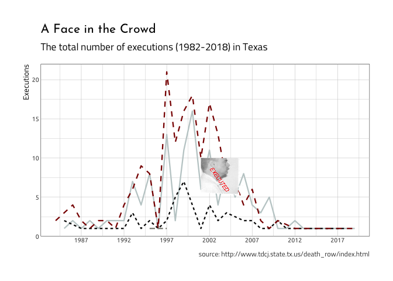

Manipulating images with `grid`
================
Martin Frigaard
2019-11-28

### Example 2: add this image as an annoation using `grid` package

Maybe a better option is to zero in on when this offender was executed
using an annotation. If you call, the original image showed a bit of
information about this offender.

``` r
DirProcessed <- fs::dir_tree("data/processed") %>%
  tibble::enframe(name = NULL) %>%
  dplyr::arrange(desc(value))
```

    #>  data/processed
    #>  ├── 2018-12-20
    #>  │   ├── 2018-12-20-ExExOffndrshtml.csv
    #>  │   ├── 2018-12-20-ExExOffndrsjpg.csv
    #>  │   └── 2018-12-20-ExOffndrsComplete.csv
    #>  ├── 2019-11-27
    #>  │   └── 2019-11-27-ExOffndrsComplete.csv
    #>  └── 2019-11-28
    #>      ├── 2019-11-28-ExExOffndrshtml.csv
    #>      ├── 2019-11-28-ExExOffndrsjpg.csv
    #>      ├── 2019-11-28-ExOffndrsComplete.csv
    #>      └── 2019-11-28-ExecOffenders.csv

``` r
ExecOffenders <- readr::read_csv(DirProcessed[[1]][1])
ExecOffenders <- ExecOffenders %>%
  dplyr::mutate(
    date = lubridate::mdy(date),
    year = lubridate::year(date),
    yday = lubridate::yday(date),
    month = lubridate::month(date, label = TRUE)) 
```

``` r
library(RColorBrewer)
# Scatter plot
colors_brewer <- ggplot2::scale_color_brewer(palette = "RdBu")
# colors_brewer
ExecOffenders %>%
  dplyr::group_by(race, year) %>% 
      dplyr::summarise(
            ex_x_race_year = sum(n())) %>% 
    dplyr::arrange(desc(ex_x_race_year)) %>% 
  ggplot2::ggplot(aes(
    y = ex_x_race_year,
    x = year,
    color = race
  )) -> base_ggplot2
```

``` r
test_magick_final <- magick::image_read("figs/test_magick_final.png")
```

A quick Google search tells me when he was executed:

[Status: Executed by lethal injection in Texas on
January 22, 2003](http://murderpedia.org/male.L/l1/lookingbill-robert.htm)

## Edit image for annotation

I want the mugshot to show up on the graph around that date. This will
take some additional resizing, and rotating,

### Annotate images with `magick::image_annotate()`

I added an annotation (`magick::image_annotate()`) to the image and made
it transparent with `magick::image_transparent()`.

``` r
test_magick_resize <- magick::image_scale(test_magick_final, "x500") # height: 300px
# test_magick_resize
# rotate to remove the text ----
test_magick_rotate270v3 <- magick::image_rotate(test_magick_resize,
  degrees = 270
)
# test_magick_rotate270v3
# crop side view out of picture ----
test_magick_crop4 <- magick::image_crop(
  image = test_magick_rotate270v3,
  geometry = "750x360+10"
)
# test_magick_crop4
# rotate again to clean up line at top of image
test_magick_rotate270v4 <- magick::image_rotate(test_magick_crop4,
  degrees = 270
)
# test_magick_rotate270v4
# crop out line
test_magick_crop5 <- magick::image_crop(
  image = test_magick_rotate270v4,
  geometry = "750x400+10"
)
# test_magick_crop5
# rotate back ---
test_magick_rotate90v03 <- magick::image_rotate(test_magick_crop5,
  degrees = 180
)
# test_magick_rotate90v03
test_magick_annotate <- magick::image_annotate(
  image = test_magick_rotate90v03,
  text = "EXECUTED",
  size = 50,
  degrees = 60,
  color = "red",
  location = "+100+90"
)
# test_magick_annotate
test_magick_transparent <- magick::image_transparent(test_magick_annotate, color = "white")
test_magick_transparent
```

<!-- -->

This is what I see in RStudio.

<!-- -->

Now I create another plot with the grouped data frame.

``` r
# create plot
test_magick_raster_plot <- base_ggplot2 +
  ggplot2::geom_line(aes(linetype = race), size = 0.8,
                     show.legend = FALSE) +
  ggplot2::theme(
    legend.position = "bottom",
    legend.direction = "horizontal",
    legend.title = element_blank()
  ) +

  scale_x_continuous(breaks = seq(1982, 2018, 5)) +

  ggplot2::scale_color_manual(
    labels = c(
      "Black",
      "Hispanic",
      "White"
    ),

    values = c(
      "#C1CDCD",
      "#0A0A0A",
      "#8B8B83",
      "darkred"
    )
  ) +

  ggplot2::theme(
    legend.position = "top",
    plot.background =
      ggplot2::element_rect(
        fill = NA,
        color = NA
      ),
    panel.background =
      ggplot2::element_rect(fill = NA),
    strip.background =
      ggplot2::element_rect(
        fill = "black",
        color = NA,
        size = 1
      ),
    strip.text =
      ggplot2::element_text(colour = "white")
  ) +
  ggplot2::labs(
    title = "A Face in the Crowd",
    subtitle = "The total number of executions (1982-2018) in Texas",
    caption = "source: http://www.tdcj.state.tx.us/death_row/index.html",
    x = NULL,
    y = "Executions"
  )
test_magick_raster_plot
```

<!-- -->

And convert the image 1) with `magick::image_fill()` and then to a
raster 2) with `grDevices::as.raster()`.

``` r
# convert to image fill
test_magick_fill <- magick::image_fill(test_magick_transparent, "none")
# convert to raster
test_magick_raster <- grDevices::as.raster(test_magick_fill)
test_magick_raster_plot +
  annotation_raster(test_magick_raster,
    xmin = 2001,
    xmax = 2006,
    ymin = 5,
    ymax = 10
  )
```

<!-- -->

Great\! I will add more visualizations in the next post when look the
.html data.

-----

REFERENCES:

1.  Check out [this great
    post](http://bradleyboehmke.github.io/2015/12/scraping-html-text.html)
    from Bradley Boehmke to learn more about scraping html data.

2.  Check out [this video](https://www.youtube.com/watch?v=tHszX31_r4s)
    with Hadley Wickham and Andrew Ba Tran.
