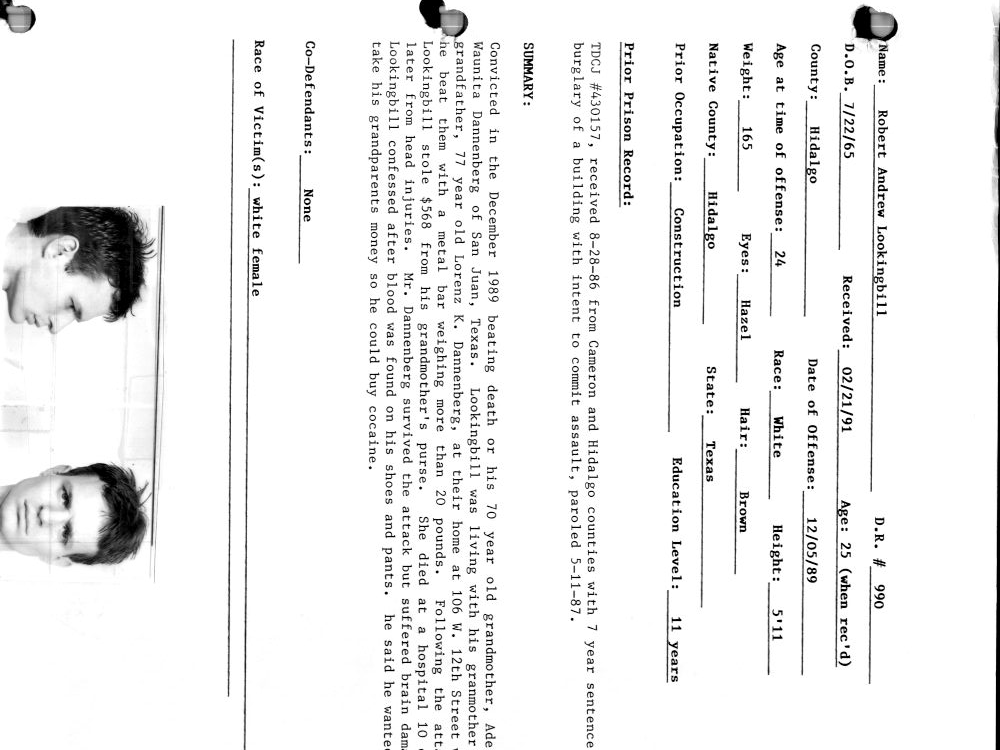
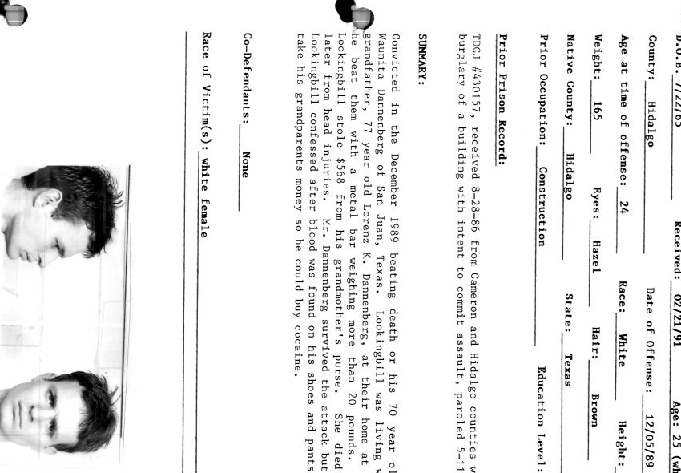
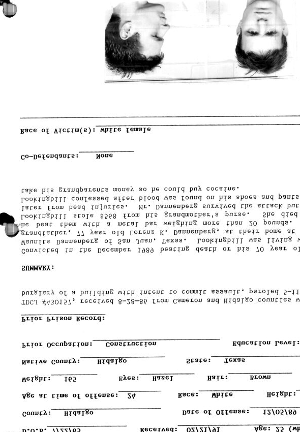
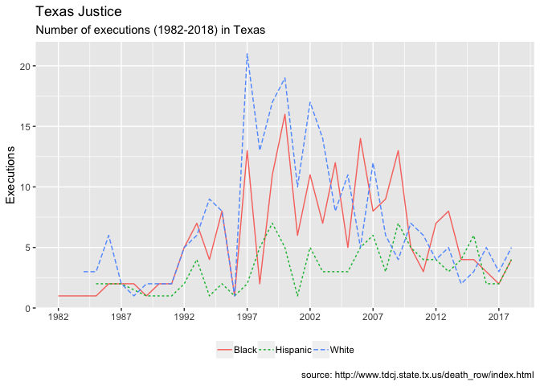
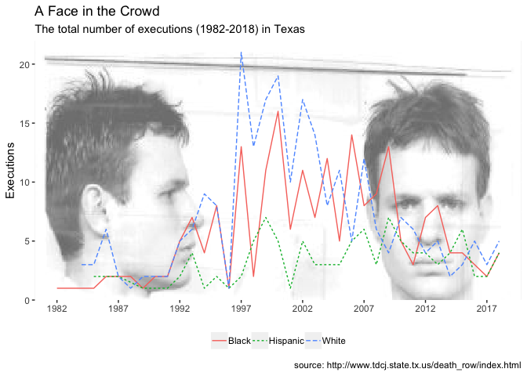
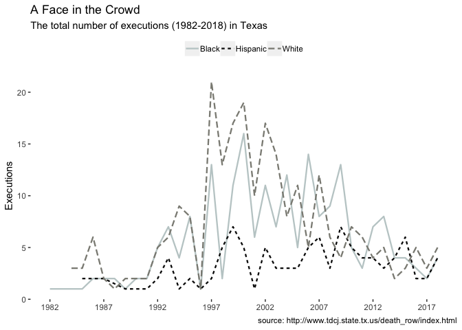
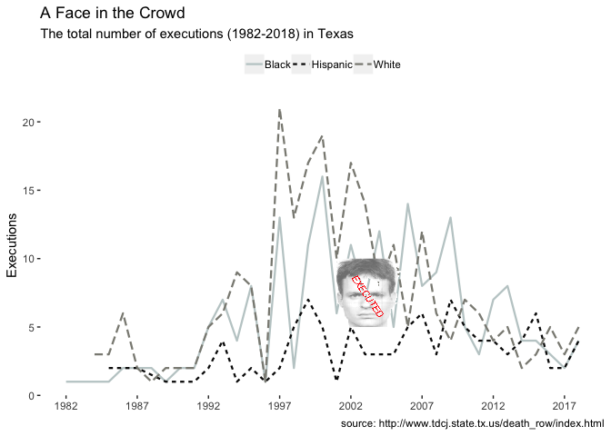

Scraping html tables with `rvest` and `xml`, downloading and exporting files with `purrr`, and manipulating images with `magick` and friends
==========

This tutorial will walk through 1) using `purrr`s iteration functions to download multiple .jpgs from a public site and 2) how to manipulate images for graphs with `magick` and friends. 

# Part 1: Scraping html tables (`rvest` and `xml`) and downloading files (`purrr`)

I constantly stumble accross data on websites I'd like to use in a visualization or analyze. R comes with two great packages for scraping data from .html tables (`rvest` and `xml`). In order to download data, sometimes each file needs to be downloaded onto your local machine. The `purrr` package has quite a few excellent functions for iteration to help with this.

## Texas death row executed offenders website

Texas Department of Criminal Justice keeps records of every inmate they
execute. We are going to scrape the data found
[here](http://www.tdcj.state.tx.us/death_row/dr_executed_offenders.html).

## Scraping the data from HTML websites

Load the `xml2` package and define the url with the data (here it’s
`webpage_url`).

``` r
library(xml2)
webpage_url <- "http://www.tdcj.state.tx.us/death_row/dr_executed_offenders.html"
webpage <- xml2::read_html(webpage_url)
```

Use the `rvest::html_table()` to find the table in the `webpage` object.
This is at position `[[1]]`.

The `dplyr::glimpse(78)` function is helpful here.

``` r
rvest::html_table(webpage)[[1]] %>% dplyr::glimpse(78)
```

    Observations: 558
    Variables: 10
    $ Execution    <int> 558, 557, 556, 555, 554, 553, 552, 551, 550, 549, 54...
    $ Link         <chr> "Offender Information", "Offender Information", "Off...
    $ Link         <chr> "Last Statement", "Last Statement", "Last Statement"...
    $ `Last Name`  <chr> "Braziel, Jr.", "Garcia", "Ramos", "Acker", "Clark",...
    $ `First Name` <chr> "Alvin", "Joseph", "Robert", "Daniel", "Troy", "Chri...
    $ TDCJNumber   <int> 999393, 999441, 999062, 999381, 999351, 999508, 9994...
    $ Age          <int> 43, 47, 64, 46, 51, 34, 66, 37, 31, 38, 62, 64, 55, ...
    $ Date         <chr> "12/11/2018", "12/04/2018", "11/14/2018", "9/27/2018...
    $ Race         <chr> "Black", "Hispanic", "Hispanic", "White", "White", "...
    $ County       <chr> "Dallas", "Dallas", "Hidalgo", "Hopkins", "Smith", "...

We can see the `Link` column is repeated, which is going to be a problem
when we put these data into their own `tibble` (R doesn’t like to repeat
the column names inside a `data.frame`).

We can check the column names with `base::colnames()`

``` r
base::colnames(x = 
           rvest::html_table(webpage)[[1]])
```

``` 
 [1] "Execution"  "Link"       "Link"       "Last Name"  "First Name"
 [6] "TDCJNumber" "Age"        "Date"       "Race"       "County"    
```

So we will create some new names for this table in a `new_colnames`
vector.

``` r
new_colnames <- c("execution", 
                   "url_offndr", 
                   "url_lststmnt", 
                   "last_name", 
                   "first_name", 
                   "tdcj_number",  
                    "age", "date", 
                   "race", "county")
```

And use the handy `magrittr::set_colnames()` function to replace the
names.

``` r
ExOffndrsRaw <- rvest::html_table(webpage)[[1]] %>% 
  magrittr::set_colnames(., new_colnames)
ExOffndrsRaw %>% dplyr::glimpse(78)
```

    Observations: 558
    Variables: 10
    $ execution    <int> 558, 557, 556, 555, 554, 553, 552, 551, 550, 549, 54...
    $ url_offndr   <chr> "Offender Information", "Offender Information", "Off...
    $ url_lststmnt <chr> "Last Statement", "Last Statement", "Last Statement"...
    $ last_name    <chr> "Braziel, Jr.", "Garcia", "Ramos", "Acker", "Clark",...
    $ first_name   <chr> "Alvin", "Joseph", "Robert", "Daniel", "Troy", "Chri...
    $ tdcj_number  <int> 999393, 999441, 999062, 999381, 999351, 999508, 9994...
    $ age          <int> 43, 47, 64, 46, 51, 34, 66, 37, 31, 38, 62, 64, 55, ...
    $ date         <chr> "12/11/2018", "12/04/2018", "11/14/2018", "9/27/2018...
    $ race         <chr> "Black", "Hispanic", "Hispanic", "White", "White", "...
    $ county       <chr> "Dallas", "Dallas", "Hidalgo", "Hopkins", "Smith", "...

Another option is to use `tibble::as_tibble()` function, but with the
`.name_repair` argument. This has five options: `"assert_unique"`,
`"unique"`, `"syntactic"`, `"none"`, and `"minimal"`. You can research
each of these using `?as_tibble`. In this case, `"unique"` or
`"syntactic"` will work just fine.

``` r
rvest::html_table(webpage)[[1]] %>% 
  tibble::as_tibble(.name_repair = "syntactic") # repair the repeated columns
```

### Assign some new names and do a little wrangling

The `url_offndr` and `url_lststmnt` variables don’t contain the actual
links,

``` r
ExOffndrsRaw %>% dplyr::select(dplyr::contains('url_')) %>% head(5)
```

``` 
            url_offndr   url_lststmnt
1 Offender Information Last Statement
2 Offender Information Last Statement
3 Offender Information Last Statement
4 Offender Information Last Statement
5 Offender Information Last Statement
```

…so we will have to go back to the webpage to find these. It also looks
like the `Race` variable has a misspelling.

``` r
ExOffndrsRaw %>% dplyr::count(race)
```

    # A tibble: 5 x 2
      race          n
      <chr>     <int>
    1 Black       202
    2 Hispanic    106
    3 Histpanic     1
    4 Other         2
    5 White       247

Collapse the `Histpanic` level into `Hispanic` and do some
reorganization of the columns.

``` r
ExOffndrs <- ExOffndrsRaw %>% 
  # reorganize a bit
  dplyr::select(first_name,
                last_name,
                race,
                age, 
                date,
                county, 
                execution,
                url_offndr,
                url_lststmnt) %>% 
  # format date
  dplyr::mutate(date = 
        lubridate::mdy(date),
            # fix up the race variable
          race = dplyr::case_when(
            race == "Histpanic" ~ "Hispanic",
            race == "Black" ~ "Black",
            race == "Hispanic" ~ "Hispanic",
            race == "White" ~ "White",
            race == "Other" ~ "Other"))
ExOffndrs %>% dplyr::glimpse(78)
```

    Observations: 558
    Variables: 9
    $ first_name   <chr> "Alvin", "Joseph", "Robert", "Daniel", "Troy", "Chri...
    $ last_name    <chr> "Braziel, Jr.", "Garcia", "Ramos", "Acker", "Clark",...
    $ race         <chr> "Black", "Hispanic", "Hispanic", "White", "White", "...
    $ age          <int> 43, 47, 64, 46, 51, 34, 66, 37, 31, 38, 62, 64, 55, ...
    $ date         <date> 2018-12-11, 2018-12-04, 2018-11-14, 2018-09-27, 201...
    $ county       <chr> "Dallas", "Dallas", "Hidalgo", "Hopkins", "Smith", "...
    $ execution    <int> 558, 557, 556, 555, 554, 553, 552, 551, 550, 549, 54...
    $ url_offndr   <chr> "Offender Information", "Offender Information", "Off...
    $ url_lststmnt <chr> "Last Statement", "Last Statement", "Last Statement"...

## Identify the links to offender information and last statements

Identify the links using the [selector
gadget](https://cran.r-project.org/web/packages/rvest/vignettes/selectorgadget.html).

Download the selector gadget app for your browser.


In order to get the links from the table, we need to pass `webpage`
through a few passes of `rvest` functions (`html_nodes` and `html_attr`)
with various `css` tags to get the correct url paths. This takes some
trial and error, but eventually I was able to figure out the the correct
combinations to get the links to the pages.

``` r
Links <- webpage %>% 
  # this get the links in the overflow table 
  # row
  rvest::html_nodes(".overflow tr") %>% 
  # the links
  rvest::html_nodes("a") %>% 
  # the header ref
  rvest::html_attr("href")
# check Links
Links %>% utils::head(20)
```

``` 
 [1] "dr_info/brazielalvin.html"        
 [2] "dr_info/brazielalvinlast.html"    
 [3] "dr_info/garciajoseph.html"        
 [4] "dr_info/garciajosephlast.html"    
 [5] "dr_info/_ramos.jpg"               
 [6] "dr_info/ramosrobertlast.html"     
 [7] "dr_info/ackerdaniel.html"         
 [8] "dr_info/ackerdaniellast.html"     
 [9] "dr_info/clarktroy.html"           
[10] "dr_info/clarktroylast.html"       
[11] "dr_info/youngchristopher.html"    
[12] "dr_info/youngchristopherlast.html"
[13] "dr_info/bibledanny.html"          
[14] "dr_info/bibledannylast.html"      
[15] "dr_info/castillojuan.html"        
[16] "dr_info/castillojuanlast.html"    
[17] "dr_info/davilaerick.html"         
[18] "dr_info/davilaericklast.html"     
[19] "dr_info/rodriguezrosendo.html"    
[20] "dr_info/rodriguezrosendolast.html"
```

The `Links` contain:

1)  A `dr_info/` path (which makes the entire path
    `"http://www.tdcj.state.tx.us/death_row/dr_info/"`).

2)  Every offender has two links–one with their full name, the other
    with a `last` string attached to the back of their full name.

Something tells me if I check the `base::length()` of `Links` with the
`base::nrow()`s in `ExOffndrs`…there will be twice as many links as rows
in executed offenders.

``` r
length(Links)
```

    [1] 1116

``` r
nrow(ExOffndrs)
```

    [1] 558

Good–this is what I want. That means each row in `ExOffndrs` has two
links associated with their name.

### Clean up the `last` statements

The `stringr` package can help me wrangle this long vector into the
`ExOffndrs` tibble.

``` r
last_pattern <- stringr::str_detect(
                            string = Links, 
                            pattern = "last")
utils::head(Links[last_pattern])
```

    [1] "dr_info/brazielalvinlast.html"     "dr_info/garciajosephlast.html"    
    [3] "dr_info/ramosrobertlast.html"      "dr_info/ackerdaniellast.html"     
    [5] "dr_info/clarktroylast.html"        "dr_info/youngchristopherlast.html"

Check to see that `Links[last_pattern]` is same length as the number of
rows in `ExOffndrs`…

``` r
base::identical(x = base::length(
                        Links[last_pattern]), 
                y = base::nrow(
                                  ExOffndrs))
```

    [1] TRUE

Subset the `Links` for the `last_pattern`, then give this vector a name
(`last_links`).

``` r
last_links <- Links[last_pattern]
last_links %>% utils::head(10)
```

``` 
 [1] "dr_info/brazielalvinlast.html"    
 [2] "dr_info/garciajosephlast.html"    
 [3] "dr_info/ramosrobertlast.html"     
 [4] "dr_info/ackerdaniellast.html"     
 [5] "dr_info/clarktroylast.html"       
 [6] "dr_info/youngchristopherlast.html"
 [7] "dr_info/bibledannylast.html"      
 [8] "dr_info/castillojuanlast.html"    
 [9] "dr_info/davilaericklast.html"     
[10] "dr_info/rodriguezrosendolast.html"
```

If I check the length of items in `last_links`, I can see there are an
identical number of rows in the data frame.

``` r
base::identical(x = base::length(last_links),
                y = base::nrow(ExOffndrs))
```

    [1] TRUE

This means I can easily assign these as a new column in `ExOffndrs`.

``` r
ExOffndrs$last_url <- last_links
ExOffndrs %>% 
  dplyr::select(last_url) %>% 
  utils::head(10)
```

``` 
                            last_url
1      dr_info/brazielalvinlast.html
2      dr_info/garciajosephlast.html
3       dr_info/ramosrobertlast.html
4       dr_info/ackerdaniellast.html
5         dr_info/clarktroylast.html
6  dr_info/youngchristopherlast.html
7        dr_info/bibledannylast.html
8      dr_info/castillojuanlast.html
9       dr_info/davilaericklast.html
10 dr_info/rodriguezrosendolast.html
```

But I am not done yet–I need to add the beginning of the web address:

`http://www.tdcj.state.tx.us/death_row/`

``` r
# test 
ExOffndrs %>% 
  dplyr::mutate(
    last_url = 
        paste0("http://www.tdcj.state.tx.us/death_row/", 
                                  last_url)) %>% 
  dplyr::pull(last_url) %>% 
  utils::head(10)
```

``` 
 [1] "http://www.tdcj.state.tx.us/death_row/dr_info/brazielalvinlast.html"    
 [2] "http://www.tdcj.state.tx.us/death_row/dr_info/garciajosephlast.html"    
 [3] "http://www.tdcj.state.tx.us/death_row/dr_info/ramosrobertlast.html"     
 [4] "http://www.tdcj.state.tx.us/death_row/dr_info/ackerdaniellast.html"     
 [5] "http://www.tdcj.state.tx.us/death_row/dr_info/clarktroylast.html"       
 [6] "http://www.tdcj.state.tx.us/death_row/dr_info/youngchristopherlast.html"
 [7] "http://www.tdcj.state.tx.us/death_row/dr_info/bibledannylast.html"      
 [8] "http://www.tdcj.state.tx.us/death_row/dr_info/castillojuanlast.html"    
 [9] "http://www.tdcj.state.tx.us/death_row/dr_info/davilaericklast.html"     
[10] "http://www.tdcj.state.tx.us/death_row/dr_info/rodriguezrosendolast.html"
```

``` r
# assign
ExOffndrs <- ExOffndrs %>% 
  dplyr::mutate(
    last_url = 
        paste0("http://www.tdcj.state.tx.us/death_row/", 
                                  last_url))
```

Test one of these out in the browser.

### Clean up the `dr_info`

Now I want the offender information links (so I omit the links with
`last` in the pattern).

``` r
info_pattern <- !stringr::str_detect(
                            string = Links, 
                            pattern = "last")
utils::head(Links[info_pattern])
```

    [1] "dr_info/brazielalvin.html"     "dr_info/garciajoseph.html"    
    [3] "dr_info/_ramos.jpg"            "dr_info/ackerdaniel.html"     
    [5] "dr_info/clarktroy.html"        "dr_info/youngchristopher.html"

Check the `base::length()`.

``` r
base::identical(x = base::length(
                        Links[info_pattern]), 
                y = base::nrow(
                                  ExOffndrs))
```

    [1] TRUE

``` r
info_links <- Links[info_pattern]
base::length(info_links)
```

    [1] 558

Repeat the process from above.

``` r
ExOffndrs$info_url <- info_links
ExOffndrs %>% 
  dplyr::mutate(
    info_url = 
        paste0("http://www.tdcj.state.tx.us/death_row/", 
                                  info_url)) %>% 
  dplyr::pull(last_url) %>% 
  utils::head(10)
```

``` 
 [1] "http://www.tdcj.state.tx.us/death_row/dr_info/brazielalvinlast.html"    
 [2] "http://www.tdcj.state.tx.us/death_row/dr_info/garciajosephlast.html"    
 [3] "http://www.tdcj.state.tx.us/death_row/dr_info/ramosrobertlast.html"     
 [4] "http://www.tdcj.state.tx.us/death_row/dr_info/ackerdaniellast.html"     
 [5] "http://www.tdcj.state.tx.us/death_row/dr_info/clarktroylast.html"       
 [6] "http://www.tdcj.state.tx.us/death_row/dr_info/youngchristopherlast.html"
 [7] "http://www.tdcj.state.tx.us/death_row/dr_info/bibledannylast.html"      
 [8] "http://www.tdcj.state.tx.us/death_row/dr_info/castillojuanlast.html"    
 [9] "http://www.tdcj.state.tx.us/death_row/dr_info/davilaericklast.html"     
[10] "http://www.tdcj.state.tx.us/death_row/dr_info/rodriguezrosendolast.html"
```

``` r
ExOffndrs <- ExOffndrs %>% 
  dplyr::mutate(
    info_url = 
        paste0("http://www.tdcj.state.tx.us/death_row/", 
                                  info_url))
```

Test a few of these out in the browser:

`http://www.tdcj.state.tx.us/death_row/dr_info/brookscharlie.html`


Now we assign these links to the `ExOffndrs` data frame. But first make
sure they match up.

``` r
ExOffndrs %>% 
  dplyr::select(last_name, 
                first_name) %>%
  utils::head(10)
```

``` 
        last_name  first_name
1    Braziel, Jr.       Alvin
2          Garcia      Joseph
3           Ramos      Robert
4           Acker      Daniel
5           Clark        Troy
6           Young Christopher
7           Bible       Danny
8        Castillo        Juan
9          Davila       Erick
10 Rodriguez, III     Rosendo
```

``` r
ExOffndrs %>% 
  dplyr::select(last_name, 
                first_name) %>%
  utils::tail(10)
```

``` 
      last_name first_name
549    Rumbaugh    Charles
550      Porter      Henry
551      Milton    Charles
552  De La Rosa      Jesse
553       Morin    Stephen
554    Skillern      Doyle
555    Barefoot     Thomas
556     O'Bryan     Ronald
557       Autry      James
558 Brooks, Jr.    Charlie
```

## Create indicator for .html vs .jpgs

Create a binary variable to identify if this is a `.jpg` or `.html` path
and name the new data frame `ExOffndrsComplete`.

``` r
ExOffndrsComplete <- ExOffndrs %>% 
  dplyr::mutate(jpg_html = 
        dplyr::case_when(
          str_detect(string = info_url, pattern = ".jpg") ~ "jpg", 
          str_detect(string = info_url, pattern = ".html") ~ "html")) 
```

Use `dplyr::sample_n` to check a few examples of this new variable.

``` r
ExOffndrsComplete %>% 
  dplyr::sample_n(size = 10) %>% 
  dplyr::select(info_url, 
                jpg_html) %>% 
  utils::head(10)
```

``` 
                                                               info_url
1        http://www.tdcj.state.tx.us/death_row/dr_info/russelljames.jpg
2      http://www.tdcj.state.tx.us/death_row/dr_info/greenjonathon.html
3       http://www.tdcj.state.tx.us/death_row/dr_info/shoreanthony.html
4          http://www.tdcj.state.tx.us/death_row/dr_info/claykeith.html
5     http://www.tdcj.state.tx.us/death_row/dr_info/starvaggijoseph.jpg
6        http://www.tdcj.state.tx.us/death_row/dr_info/goodwinalvin.jpg
7           http://www.tdcj.state.tx.us/death_row/dr_info/soriajuan.jpg
8  http://www.tdcj.state.tx.us/death_row/dr_info/martinezalexander.html
9       http://www.tdcj.state.tx.us/death_row/dr_info/teaguedelbert.jpg
10       http://www.tdcj.state.tx.us/death_row/dr_info/johnsoneddie.jpg
   jpg_html
1       jpg
2      html
3      html
4      html
5       jpg
6       jpg
7       jpg
8      html
9       jpg
10      jpg
```

## Use `purrr` to download the .jpg files

Follow these three `purrr` steps from the workshop by [Charlotte
Wickham](https://www.rstudio.com/resources/videos/happy-r-users-purrr-tutorial/).

### 1\. Do it for one element

We can test the new url columns in the `ExOffndrsComplete` with the
`magick::image_read()` funciton.

``` r
library(magick)
test_image <- ExOffndrsComplete %>% 
  dplyr::filter(jpg_html == "jpg") %>% 
  dplyr::select(info_url) %>% 
  dplyr::sample_n(size = 1) %>% 
  base::as.character() 
  magick::image_read(test_image)
```

You should see an image in the RStudio viewer pane.


### 2\. Turn it into a recipe

Put these urls into a vector (`jpg_url`), then create a folder to
download them into (`jpg_path`).

``` r
ExOffndrsCompleteJpgs <- ExOffndrsComplete %>% 
  dplyr::filter(jpg_html == "jpg") 
jpg_url <- ExOffndrsCompleteJpgs$info_url
if (!base::file.exists("jpgs/")) {
  base::dir.create("jpgs/")
}
jpg_path <- paste0("jpgs/", 
                   base::basename(jpg_url))
```

### 3\. Use `purrr` to download all files

Now use the `purrr::walk2()` function to download the files. How does
`walk2` work?

First look at the arguments for
    `utils::download.file()`.

``` r
base::args(utils::download.file)
```

    function (url, destfile, method, quiet = FALSE, mode = "w", cacheOK = TRUE, 
        extra = getOption("download.file.extra"), ...) 
    NULL

### How to `walk2()`

The help files tell us this function is “specialized for the two
argument case”.

So `.x` and `.y` become the two arguments we need to iterate over
`download.file()`,

1)  `.x` = the file path, which we created with the selector gadget
    above (in `jpg_url`)

2)  `.y` = the location we want the files to end up (`jpg_path`), and

3)  the function we want to iterate over `.x` and `.y`
    (`download.file`).

This tells R to go the url, download the file located there, and put it
in the associated `/jpgs` folder.

## Download .jpg files

``` r
purrr::walk2(.x = jpg_url, 
             .y = jpg_path, 
             .f = download.file)
# trying URL 'http://www.tdcj.state.tx.us/death_row/dr_info/bigbyjames.jpg'
# Content type 'image/jpeg' length 129128 bytes (126 KB)
# ==================================================
# downloaded 126 KB
# 
# trying URL 'http://www.tdcj.state.tx.us/death_row/dr_info/ruizroland.jpg'
# Content type 'image/jpeg' length 138981 bytes (135 KB)
# ==================================================
# downloaded 135 KB
# 
# trying URL 'http://www.tdcj.state.tx.us/death_row/dr_info/garciagustavo.jpg'
# Content type 'image/jpeg' length 164678 bytes (160 KB)
# ==================================================
# downloaded 160 KB
```

This might take awhile, but when its done, check the number of files in
this folder.

``` r
fs::dir_ls("jpgs") %>% base::length()
```

There you have it\! 377 images of downloaded offenders\!

## Use `purrr` and `dplyr` to split and export .csv files

This next use of `purrr` and iteration will cover how to:

1.  Split the `ExOffndrsComplete` data frame into `ExExOffndrshtml` and
    `ExExOffndrsjpg`
2.  Save each of these data frames as .csv files

We should have two datasets with the following counts.

``` r
ExOffndrsComplete %>% dplyr::count(jpg_html, sort = TRUE)
```

    # A tibble: 2 x 2
      jpg_html     n
      <chr>    <int>
    1 jpg        378
    2 html       180

These are new experimental functions from `dplyr`, and a big shout out
to Luis Verde Arregoitia for [his
post](https://luisdva.github.io/rstats/export-iteratively/) on a similar
topic.

The `dplyr::group_split()` *“returns a list of tibbles. Each tibble
contains the rows of .tbl for the associated group and all the columns,
including the grouping variables”*, and I combine it with
`purrr::walk()` and `readr::write_csv()` to export each file.

``` r
# fs::dir_ls(".")
if (!file.exists("data")) {
  dir.create("data")
}
ExOffndrsComplete %>% 
  dplyr::group_by(jpg_html) %>% 
  dplyr::group_split() %>% 
  purrr::walk(~.x %>%  write_csv(path = paste0("data/", 
                                               base::noquote(lubridate::today()),
                                               "-ExExOffndrs",
                                               unique(.x$jpg_html), 
                                               ".csv")))
fs::dir_ls("data")
```

    data/2018-12-20-ExExOffndrshtml.csv
    data/2018-12-20-ExExOffndrsjpg.csv
    data/2018-12-20-ExOffndrsComplete.csv

### End


***

# Part 2: Manipulating images with `magick` and friends

This tutorial shows how to manipulate images in R using `magik` and friends.

## Motivation

This is a continuation from the previous post
[here](https://github.com/mjfrigaard/dont-mess-with-texas/blob/master/1-scrape-and-iterate.Rmd).
We will load previous .csv file of all executions.

## Import the data

## The `magik` package

I will be using the
[magik](https://cran.r-project.org/web/packages/magick/vignettes/intro.html)
package for processing and manipulating these images. I advise checking
out the entire vignette.

## Create a test image

Convert this to a `magick` image using the `image_read()` function. The
code below selects a jpg at random, and If I print this within the
Rmarkdown file, I see the output in the viewer pane.

``` r
library(magick)
ExOffndrsComplete %>% 
  dplyr::filter(jpg_html == "jpg") %>% 
  dplyr::select(info_url) %>% 
  dplyr::sample_n(size = 1) %>% 
  base::as.character() %>% 
  magick::image_read()
```

<!-- -->

I store this as an object in R named `test_image`.

## Read, write, join, or combine (`image_read`)

I create `test_magick_img` from `magick::image_read()`, and then go on
making the transformations as necessary.

``` r
test_magick_img <- magick::image_read(test_image)
test_magick_img
```

<!-- -->

*TIP: come up with a naming convention for each step so you can use
RStudio’s viewer pane to see the manipulations.*

## Basic transformations

These functions are for basic image movement/manipulations you would do
with any basic photo editing app.

### Crop with `magick::image_crop()`

Now I want to remove the text and focus on the mugshot. This might need
to be adjusted slightly for each new `test_magick_img`.

``` r
# crop this image
test_magick_crop1 <- magick::image_crop(image = test_magick_img, 
                                      geometry = "750x1000+10")
test_magick_crop1
```

<!-- -->

This should have trimmed the extra space off the bottom of the image.

### Rotate with `magick::image_rotate()`

I want to rotate this image by 90 degrees.

``` r
# rotate this image
test_magick_rotate90 <- magick::image_rotate(test_magick_crop1, 
                                          degrees = 90)
test_magick_rotate90
```

<!-- -->

This is what it looks like in RStudio.

<!-- -->

Now I want to remove the rest of the text and focus on the mugshot. This
might need to be adjusted slightly for each new `test_image`.

``` r
# crop this image
test_magick_crop2 <- magick::image_crop(image = test_magick_rotate90, 
                                      geometry = "850x590+01")
test_magick_crop2
```

<!-- -->

Now I will rotate this image back to center and flip it using
`magick::image_flip()`

``` r
# rotate this image
test_magick_rotate270 <- magick::image_rotate(test_magick_crop2, 
                                          degrees = 270)
# rotate this image
test_magick_flip <- magick::image_flip(test_magick_rotate270)
test_magick_flip
```

<!-- -->

<!-- -->

I’ll crop the rest of the text out of the image, and trim the whitespace
for the plot.

``` r
# crop this image
test_magick_crop3 <- magick::image_crop(image = test_magick_flip, 
                                      geometry = "750x200+10")
# test_magick_crop3
# flip this image again
test_magick_flip2 <- magick::image_flip(test_magick_crop3)
# test_magick_flip2
# rotate to remove the dot
test_magick_rotate270v2 <-  magick::image_rotate(test_magick_flip2, 
                                                 degrees = 270)
# test_magick_rotate270v2
# crop the dot out
test_magick_crop4 <- magick::image_crop(image = test_magick_rotate270v2, 
                                      geometry = "550x410+10")
# test_magick_crop4
# rotate back to center
test_magick_rotate90v02 <-  magick::image_rotate(test_magick_crop4, 
                                                 degrees = 90)
# test_magick_rotate90v02

# remove white background
# Here we will trim the image up a bit with the `fuzz` argument
test_magick_clean <- magick::image_trim(image = test_magick_rotate90v02, 
                                       fuzz = 1)
test_magick_clean
```

<!-- -->

Now that I have all the trimming on and cropping done, I will add some
effects for the `ggplot2` image. I want the image to be a bit more
subdued, so I will use `magick::image_modulate()` and
`magick::image_flatten()` to create these effects.

``` r
test_image_modulate <- magick::image_modulate(test_magick_clean, 
                       brightness = 100, 
                       saturation = 25, 
                       hue = 20)
# test_image_modulate
test_magick_final <- magick::image_flatten(test_image_modulate, 
                                           operator = "Threshold")
test_magick_final
```

<!-- -->

## Data for plot

I want to graph the number of executions over time (year) by race. I can
do this by getting a grouped data from using `dplyr`’s functions.

``` r
ExOffndByRaceYear <- ExOffndrsComplete %>% 
  dplyr::filter(race != "Other") %>% 
    dplyr::mutate(
        year = lubridate::year(date),
        yday = lubridate::yday(date),
        month = lubridate::month(date, 
                      label = TRUE)) %>% 
    dplyr::group_by(race, year) %>% 
      dplyr::summarise(
            ex_x_race_year = sum(n())) %>% 
    dplyr::arrange(desc(ex_x_race_year)) 
ExOffndByRaceYear %>% glimpse(78)
```

    Observations: 101
    Variables: 3
    $ race           <chr> "White", "White", "White", "White", "Black", "Blac...
    $ year           <dbl> 1997, 2000, 1999, 2002, 2000, 2006, 2003, 1997, 20...
    $ ex_x_race_year <int> 21, 19, 17, 17, 16, 14, 14, 13, 13, 13, 12, 12, 11...

## Plot executions over time

I create `base_ggplot2` as the basic plot I want as a layer for the
image to appear on top of.

``` r
base_ggplot2 <- ExOffndByRaceYear %>% 
  ggplot2::ggplot(aes(y = ex_x_race_year, 
                      x = year, 
                      color = race)) 
base_ggplot2 +
ggplot2::geom_line(aes(linetype = race)) +
        ggplot2::theme(legend.position = "bottom", 
                     legend.direction = "horizontal", 
                     legend.title = element_blank()) + 
      scale_x_continuous(breaks = seq(1982, 2018, 5)) +
          ggplot2::labs(
              title = "Texas Justice",
          subtitle = "Number of executions (1982-2018) in Texas",
caption = "source: http://www.tdcj.state.tx.us/death_row/index.html",
x = NULL,
y = "Executions")
```

<!-- -->

### Example 1: over plot using `grid` package

The first example I’ll plot will use image as the ‘canvas’. This
requires exporting the image as a .jpeg, then reloading it and using the
[`ggpubr`](http://www.sthda.com/english/articles/24-ggpubr-publication-ready-plots/)
package.

``` r
library(jpeg)
# 1) export the `mwe_magick_trim` file,
magick::image_write(test_magick_final, 
                    path =
                    paste0("image/",
                           base::noquote(lubridate::today()),
                           "-test_magick_final",
                    format = ".jpg"))
# 2) then read it back in as an `jpeg::readJPEG()`.
# fs::dir_ls("image")
imgJPEG <- jpeg::readJPEG("image/2018-12-20-test_magick_final.jpg")
```

Now I can add the `imgJPEG` after the base layer (but before I map the
`geom_line()` and `geom_theme()`).

``` r
library(ggpubr)
base_ggplot2 + 
  # this is the image for the background
        ggpubr::background_image(imgJPEG) +
  
  # here is the line graph
  ggplot2::geom_line(aes(linetype = race)) +
        ggplot2::theme(legend.position = "bottom", 
                     legend.direction = "horizontal", 
                     legend.title = element_blank()) + 
      scale_x_continuous(breaks = seq(1982, 2018, 5)) +
  # add some labels
          ggplot2::labs(
              title = "A Face in the Crowd",
          subtitle = "The total number of executions (1982-2018) in Texas",
caption = "source: http://www.tdcj.state.tx.us/death_row/index.html",
x = NULL,
y = "Executions")
```

<!-- -->

### Example 2: add this image as an annotation using `grid` package

I think a better option is to zero in on when this offender was executed
using an annotation. If you call, the original image showed a bit of
information about this offender.

``` r
test_magick_img
```

A quick Google search tells me when he was executed:

[Status: Executed by lethal injection in Texas on
January 22, 2003](http://murderpedia.org/male.L/l1/lookingbill-robert.htm)

## Edit image for annotation

I want the mugshot to show up on the graph around that date. This will
take some additional re-sizing, and rotating,

### Annotate images with `magick::image_annotate()`

I added an annotation (`magick::image_annotate()`) to the image and made
it transparent with
`magick::image_transparent()`.

``` r
test_magick_resize <- magick::image_scale(test_magick_final, "x500") # height: 300px
# test_magick_resize
# rotate to remove the text ----
test_magick_rotate270v3 <-  magick::image_rotate(test_magick_resize, 
                                                 degrees = 270)
# test_magick_rotate270v3
# crop side view out of picture ----
test_magick_crop4 <- magick::image_crop(image = test_magick_rotate270v3, 
                                      geometry = "750x360+10")
# test_magick_crop4
# rotate again to clean up line at top of image
test_magick_rotate270v4 <-  magick::image_rotate(test_magick_crop4, 
                                                 degrees = 270)
# test_magick_rotate270v4
# crop out line
test_magick_crop5 <- magick::image_crop(image = test_magick_rotate270v4, 
                                      geometry = "750x400+10")
# test_magick_crop5
# rotate back ---
test_magick_rotate90v03 <-  magick::image_rotate(test_magick_crop5, 
                                                 degrees = 180)
# test_magick_rotate90v03
test_magick_annotate <- magick::image_annotate(image = test_magick_rotate90v03, 
               text = "EXECUTED", 
               size = 50, 
               degrees = 60,
               color = "red",
               location = "+100+90")
# test_magick_annotate
test_magick_transparent <- magick::image_transparent(test_magick_annotate, color = "white")
test_magick_transparent
```

<!-- -->

This is what I see in RStudio.

<!-- -->

Now I create another plot with the grouped data frame.

``` r
# create plot
test_magick_raster_plot <- base_ggplot2 +
      ggplot2::geom_line(aes(linetype = race), size = 0.8) +
        ggplot2::theme(legend.position = "bottom", 
                     legend.direction = "horizontal", 
                     legend.title = element_blank()) + 
  
      scale_x_continuous(breaks = seq(1982, 2018, 5)) +
  
      ggplot2::scale_color_manual(
              labels = c("Black",
                        "Hispanic",
                        "White"),
              
              values = c("#C1CDCD", 
                         "#0A0A0A", 
                         "#8B8B83")) +
  
      ggplot2::theme(
        legend.position = "top",
              plot.background = 
                      ggplot2::element_rect(fill = NA, 
                                            color = NA),
              panel.background =
                      ggplot2::element_rect(fill = NA), 
              strip.background =
                      ggplot2::element_rect(fill = "black", 
                                          color = NA, 
                                          size = 1),
              strip.text =
                      ggplot2::element_text(colour = "white")) +
          ggplot2::labs(
          title = "A Face in the Crowd",
          subtitle = "The total number of executions (1982-2018) in Texas",
caption = "source: http://www.tdcj.state.tx.us/death_row/index.html",
x = NULL,
y = "Executions")
test_magick_raster_plot
```

<!-- -->

And convert the image 1) with `magick::image_fill()` and then to a
raster 2) with `grDevices::as.raster()`.

``` r
# convert to image fill
test_magick_fill <- magick::image_fill(test_magick_transparent, 'none')
# convert to raster
test_magick_raster <- grDevices::as.raster(test_magick_fill)
test_magick_raster_plot + 
  annotation_raster(test_magick_raster, 
                    xmin = 2001, 
                    xmax = 2006, 
                    ymin = 5, 
                    ymax = 10)
```

<!-- -->

Great\! I will add more visualizations in the next post when look the
.html data.

-----

REFERENCES:

1.  Check out [this great
    post](http://bradleyboehmke.github.io/2015/12/scraping-html-text.html)
    from Bradley Boehmke to learn more about scraping html data.

2.  Check out [this video](https://www.youtube.com/watch?v=tHszX31_r4s)
    with Hadley Wickham and Andrew Ba Tran.
