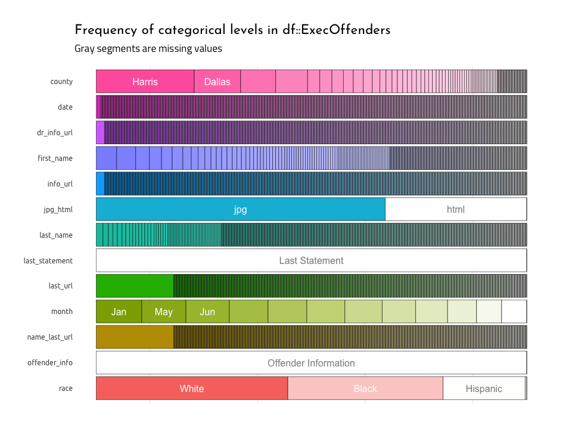
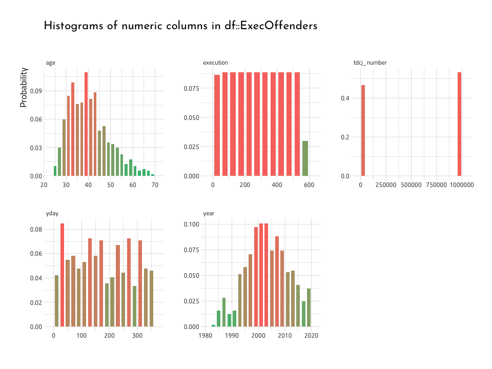
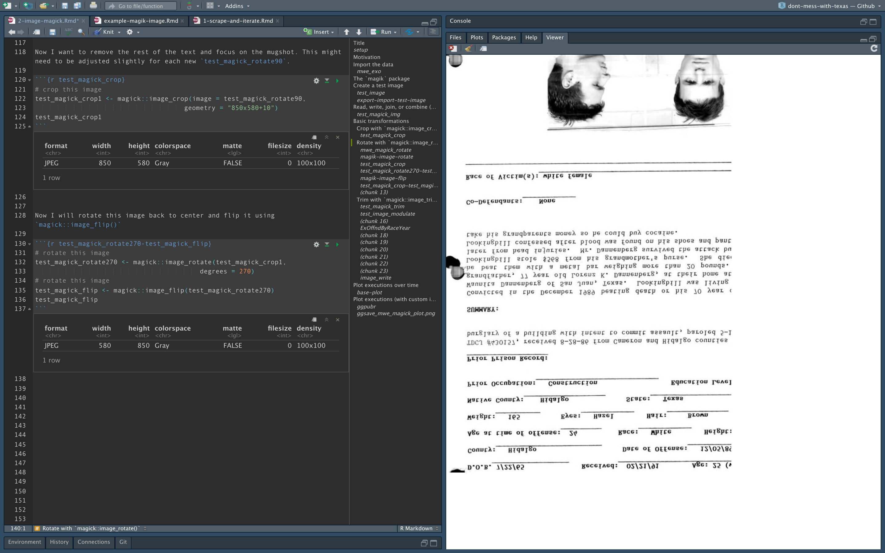
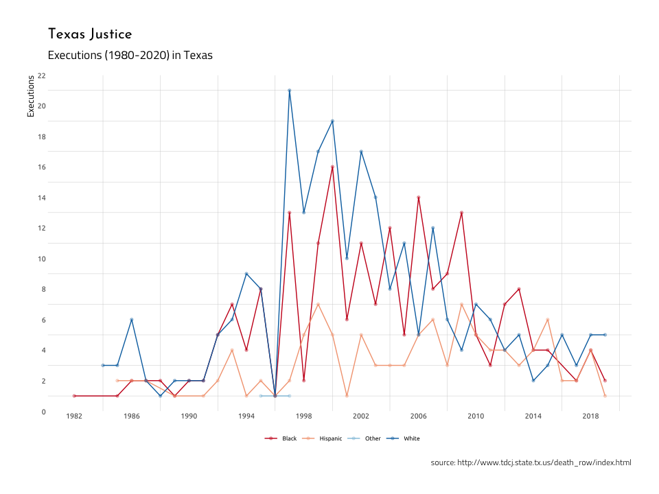

Don’t Mess with Texas: data from Texas department of corrections
================

These data come from the [Texas Department of Criminal
Justice](https://www.tdcj.texas.gov/index.html) website that holds death
row information on executed
[offenders](https://www.tdcj.texas.gov/death_row/dr_executed_offenders.html).

## Executions in Texas

Capital punishment in Texas has a long history (read about it
[here](https://en.wikipedia.org/wiki/Capital_punishment_in_Texas)). At
the time of this writing (**2019-11-28**), Texas has carried out more
than 1/3 of the total executions in the United States. The project tells
the story of capitol punishment in Texas (and the US). I created this
project to raise awareness about the reality of state-sanctioned deaths,
and to try and understand more about why Texas is such an outlier with
respect to capitol punishment.

I stumbled across data this website and decided to use them in a series
of visualizations. R comes with two great packages for scraping data
from .html tables (`rvest` and `xml`). In order to download data,
sometimes each file needs to be downloaded onto your local machine. The
`purrr` package has quite a few excellent functions for iteration to
help with this.

## Texas death row executed offenders website

Texas Department of Criminal Justice keeps records of every inmate they
execute. We are going to scrape the data found
[here](http://www.tdcj.state.tx.us/death_row/dr_executed_offenders.html).

### The data

``` r
DirProcessed <- fs::dir_tree("data/processed") %>%
  tibble::enframe(name = NULL) %>%
  dplyr::arrange(desc(value))
```

    #>  data/processed
    #>  ├── 2018-12-20
    #>  │   ├── 2018-12-20-ExExOffndrshtml.csv
    #>  │   ├── 2018-12-20-ExExOffndrsjpg.csv
    #>  │   └── 2018-12-20-ExOffndrsComplete.csv
    #>  ├── 2019-11-27
    #>  │   └── 2019-11-27-ExOffndrsComplete.csv
    #>  └── 2019-11-28
    #>      ├── 2019-11-28-ExExOffndrshtml.csv
    #>      ├── 2019-11-28-ExExOffndrsjpg.csv
    #>      ├── 2019-11-28-ExOffndrsComplete.csv
    #>      └── 2019-11-28-ExecOffenders.csv

``` r
ExecOffenders <- readr::read_csv(DirProcessed[[1]][1])
ExecOffenders <- ExecOffenders %>%
  dplyr::mutate(
    date = lubridate::mdy(date),
    year = lubridate::year(date),
    yday = lubridate::yday(date),
    month = lubridate::month(date, label = TRUE)) 
```

``` r
library(inspectdf)
inspectdf::inspect_cat(df1 = ExecOffenders) %>% 
  inspectdf::show_plot(text_labels = TRUE)
```

<!-- -->

``` r
library(inspectdf)
inspectdf::inspect_num(df1 = ExecOffenders) %>% 
  inspectdf::show_plot(text_labels = TRUE)
```

<!-- -->

### The jpgs

The information on the offenders are stored in .jpg files, so these
needed to be downloaded using `purrr::walk2()`. These are not all small
files, so this can take a bit depending on your internet speed.


### Editing images

I used `magick` and `grid` to edit the images. You can see the results
here:

<!-- -->

<!-- -->

<!-- -->

<!-- -->

<!-- -->

<!-- -->

<!-- -->

<!-- -->

<!-- -->

## Executions over time

This is a plot of executinos over time.

<!-- -->
